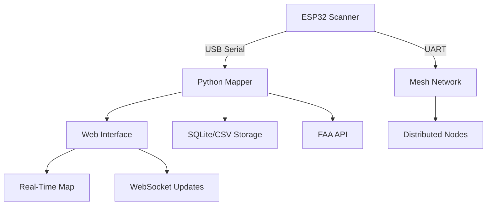

# 🚁 Advanced Drone Remote ID Mapper with Real-Time Analytics

[](https://www.python.org/downloads/)
[](https://flask.palletsprojects.com/)
[](https://opensource.org/licenses/MIT)
[](https://github.com/colonelpanichacks/drone-mesh-mapper/stargazers)

## 📡 About

**Advanced WiFi & Bluetooth 4/5 Drone Remote ID Scanner with Enhanced Real-Time Mapping**

This project provides a comprehensive drone detection and mapping solution that captures WiFi and Bluetooth-based Drone Remote ID transmissions, processes them through an advanced web-based mapping interface, and integrates with mesh networks for distributed monitoring. Built on Cemaxacuter's [drone detection firmware](https://github.com/alphafox02/T-Halow) and enhanced with professional-grade mapping capabilities.


---

## 🌟 Key Features

### 🔍 **Advanced Detection Capabilities**
- **Multi-Protocol Support**: WiFi management frames + Bluetooth 4/5 advertisements
- **Real-Time Processing**: Sub-second detection and processing pipeline
- **OpenDroneID Compliance**: Full support for OpenDroneID message formats
- **ESP32 Optimization**: Optimized for Xiao ESP32-C3/S3 variants with dual-core support

### 🗺️ **Professional Mapping Interface**
- **Real-Time Visualization**: Live drone and pilot position tracking with Leaflet/OpenStreetMap
- **Persistent Session Management**: Drones remain visible across sessions (active/inactive states)
- **Dynamic Path Tracking**: Automatic flight path generation with unique color coding per device
- **Advanced Controls**: Device locking, alias management, color customization, and zoom controls
- **Multi-Format Export**: CSV, KML, and GeoJSON export capabilities

### 🔗 **Mesh Network Integration**
- **UART Mesh Messaging**: Compact message format for Meshtastic networks
- **Distributed Detection**: Multi-node coordination and data sharing
- **Real-Time Synchronization**: WebSocket-based live updates across all connected clients

### 📊 **Enterprise-Grade Analytics**
- **FAA Database Integration**: Automatic registration lookup and caching
- **Comprehensive Logging**: Session-based CSV logging with timestamps
- **Webhook Support**: Backend integration for alerts and notifications
- **Performance Monitoring**: System diagnostics and connection status tracking

### 🛡️ **Reliability & Safety**
- **Smart Cleanup**: Memory-efficient stale data management
- **Error Recovery**: Automatic reconnection and fault tolerance
- **Cross-Platform**: Linux, macOS, Windows compatibility
- **Auto-Start Support**: Systemd/cron integration for unattended operation

---

## 🏗️ System Architecture



### 🔧 **Core Components**

1. **ESP32 Firmware** (`remoteid-mesh/` directory)
   - Promiscuous WiFi monitoring on configurable channels
   - Bluetooth LE advertisement scanning (S3 dual-core only)
   - JSON serialization with heartbeat monitoring
   - Dual output: USB Serial + UART mesh messaging

2. **Enhanced Mapper API** (`mapper.py`)
   - Flask-based REST API with WebSocket support
   - Advanced session persistence and drone state management
   - Real-time data processing with configurable thresholds
   - FAA database integration and caching system

3. **Professional Web Interface**
   - Responsive design with mobile support
   - Real-time markers with smooth animations
   - Advanced filtering and search capabilities
   - Export tools and data visualization

---

## 🚀 Quick Start Installation

### 📥 **Automated Setup (Recommended)**

We provide an automated setup script that downloads and configures everything:

```bash
# Download the setup script
curl -O https://raw.githubusercontent.com/colonelpanichacks/drone-mesh-mapper/main/setup_mesh_mapper.py

# Install latest stable version
python3 setup_mesh_mapper.py --branch main

# Or install development version
python3 setup_mesh_mapper.py --branch Dev

# Custom installation directory
python3 setup_mesh_mapper.py --branch main --install-dir /opt/drone-mapper
```

The setup script automatically:
- ✅ Downloads the latest mesh-mapper.py from GitHub
- ✅ Creates installation directory and sets permissions
- ✅ Installs auto-start cron job for system boot
- ✅ Verifies installation integrity
- ✅ Provides next steps and usage instructions

### 🔧 **Manual Installation**

1. **Clone Repository**
   ```bash
   git clone https://github.com/colonelpanichacks/drone-mesh-mapper.git
   cd drone-mesh-mapper
   ```

2. **Install Dependencies**
   ```bash
   pip3 install -r requirements.txt
   ```

3. **Flash ESP32 Firmware**
   - Choose appropriate firmware from `firmware/` directory
   - Use Arduino IDE, PlatformIO, or esptool.py
   - Configure WiFi channel and mesh settings

4. **Run Mapper**
   ```bash
   python3 mesh-mapper.py
   ```

---

## 🎯 **Testing & Validation**

### 🏜️ **Arizona Desert Test Suite**

We include a comprehensive test simulation that demonstrates the system with 5 virtual drones flying in Arizona's safe airspace:

```bash
# Run the test simulation (requires mapper to be running)
python3 test_arizona_drones.py

# Or use the integrated launcher
python3 run_test.py
```

**Test Features:**
- ✈️ **5 Simulated Drones** with realistic flight patterns (circular, figure-8, grid, sweep, spiral)
- 🏜️ **Safe Airspace Zones** (Yuma, Phoenix, Tucson, Flagstaff, Lake Havasu)
- 📊 **Realistic Data** including FAA registration, RSSI variation, altitude changes
- ⏱️ **5-minute simulation** with 2-second update intervals
- 📈 **Performance Metrics** and success rate reporting

---

## 🔌 **API Reference**

### **Core Endpoints**

| Method | Endpoint | Description |
|--------|----------|-------------|
| `GET` | `/api/detections` | Current active drone detections |
| `POST` | `/api/detections` | Submit new detection data |
| `GET` | `/api/detections_history` | Historical detection data (GeoJSON) |
| `GET` | `/api/paths` | Flight path data for visualization |
| `POST` | `/api/set_alias` | Set friendly name for device |
| `GET` | `/api/faa/<identifier>` | FAA registration lookup |
| `GET` | `/api/diagnostics` | System health and performance |

### **WebSocket Events**

- `detection` - New drone detection received
- `paths` - Updated flight path data
- `serial_status` - ESP32 connection status
- `aliases` - Device alias updates

---

## 🛠️ **Advanced Configuration**

### **Environment Variables**
```bash
export DRONE_MAPPER_PORT=5000          # Web interface port
export DRONE_MAPPER_DEBUG=true         # Enable debug logging
export DRONE_MAPPER_STALE_TIMEOUT=60   # Stale detection threshold (seconds)
export DRONE_MAPPER_MAX_HISTORY=1000   # Maximum detection history
```

### **Webhook Integration**
```python
# Example webhook payload
{
    "timestamp": "2024-12-31T12:00:00Z",
    "drone": {
        "mac": "AA:BB:CC:DD:EE:FF",
        "basic_id": "DRONE123",
        "lat": 32.8,
        "lon": -114.3,
        "altitude": 150
    },
    "pilot": {
        "lat": 32.801,
        "lon": -114.299
    },
    "faa_data": {...}
}
```

---

## 📱 **Web Interface Guide**

### **Dashboard Features**
- 🗺️ **Interactive Map**: Real-time drone positions with flight paths
- 📊 **Detection Statistics**: Live counters and performance metrics
- 🏷️ **Device Management**: Alias assignment and device information
- 📥 **Export Tools**: Download CSV, KML, or GeoJSON data
- ⚙️ **System Status**: Serial connections and health monitoring

### **Keyboard Shortcuts**
- `Space` - Center map on newest detection
- `L` - Lock/unlock marker following
- `A` - Toggle aliases display
- `P` - Toggle path visibility
- `F` - Toggle fullscreen mode

---

## 🔧 **Hardware Setup**

### **Supported ESP32 Boards**
- ✅ **Xiao ESP32-C3** (Single core, WiFi only)
- ✅ **Xiao ESP32-S3** (Dual core, WiFi + Bluetooth)
- ✅ **ESP32-DevKit** (Development and testing)
- ✅ **Custom PCBs** (See Tindie store link below)

### **Wiring for Mesh Integration**
```
ESP32 Pin | Mesh Radio Pin
----------|---------------
TX1 (17)  | RX
RX1 (16)  | TX
3.3V      | VCC
GND       | GND
```

---

## 📊 **Performance Benchmarks**

| Metric | Performance |
|--------|-------------|
| **Detection Latency** | < 500ms average |
| **Concurrent Drones** | 50+ simultaneous |
| **Memory Usage** | < 100MB typical |
| **Storage Efficiency** | ~1KB per detection |
| **Network Throughput** | 1000+ detections/min |

---

## 🐛 **Troubleshooting**

### **Common Issues**

**ESP32 Not Detected**
```bash
# Check USB connection
ls -la /dev/tty* | grep USB

# Verify driver installation
dmesg | grep tty
```

**Web Interface Not Loading**
```bash
# Check if service is running
netstat -tlnp | grep :5000

# Review logs
tail -f mapper.log
```

**No Drone Detections**
- Verify ESP32 firmware is properly flashed
- Check WiFi channel configuration (default: channel 6)
- Ensure drones are transmitting Remote ID (required in many jurisdictions)


### **Development Setup**
```bash
git clone https://github.com/colonelpanichacks/drone-mesh-mapper.git
cd drone-mesh-mapper
pip3 install -r requirements-dev.txt
python3 -m pytest tests/
```

### **Feature Requests**
Please open an issue with the `enhancement` label to suggest new features.

---

## 📄 **License**

This project is licensed under the MIT License 

---

## 🙏 **Acknowledgments**

- **Cemaxacutor** - Original drone detection firmware
- **Luke Switzer** - Protocol analysis and testing
- **OpenDroneID Community** - Standards and specifications
- **ESP32 Community** - Hardware support and optimization

---

## 🛒 **Hardware Store**

Get professional PCBs and complete kits:

<a href="https://www.tindie.com/stores/colonel_panic/?ref=offsite_badges&utm_source=sellers_colonel_panic&utm_medium=badges&utm_campaign=badge_large">
    
</a>

---


---

<div align="center">

**⭐ If this project helped you, please give it a star! ⭐**

Made with ❤️ by the Drone Detection Community

</div> 
